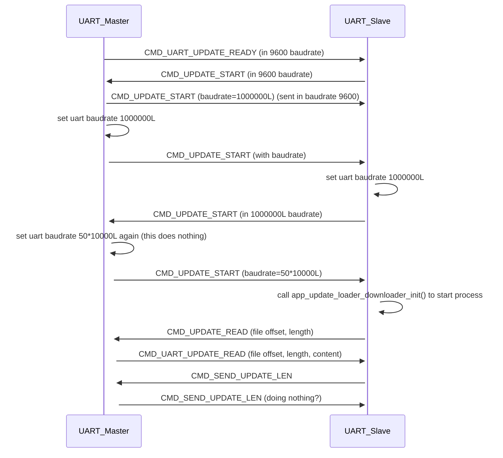

# UART SW Updating Tool for JieLi BT SoC


## Message Diagram



```mermaid
sequenceDiagram
    UART_Master->>+UART_Slave: CMD_UART_UPDATE_READY (in 9600 baudrate)
    UART_Slave->>+UART_Master: CMD_UPDATE_START (in 9600 baudrate)
    UART_Master->>+UART_Slave: CMD_UPDATE_START (baudrate=1000000L) (sent in baudrate 9600)
    UART_Master->>+UART_Master: set uart baudrate 1000000L
    UART_Master->>+UART_Slave: CMD_UPDATE_START (with baudrate)
    UART_Slave->>+UART_Slave: set uart baudrate 1000000L
    UART_Slave->>+UART_Master: CMD_UPDATE_START (in 1000000L baudrate)
    UART_Master->>+UART_Master: set uart baudrate 50*10000L again (this does nothing)
    UART_Master->>+UART_Slave: CMD_UPDATE_START (baudrate=50*10000L)
    UART_Slave->>+UART_Slave: call app_update_loader_downloader_init() to start process

    UART_Slave->>+UART_Master: CMD_UPDATE_READ (file offset, length)    
    UART_Master->>+UART_Slave: CMD_UART_UPDATE_READ (file offset, length, content)

    UART_Slave->>+UART_Master: CMD_SEND_UPDATE_LEN
    UART_Master->>+UART_Slave: CMD_SEND_UPDATE_LEN (doing nothing?)
```

## How To Use

```
python3 uart_update.py /dev/tty.usbserial-1101 ./jl_isd.ufw
```
